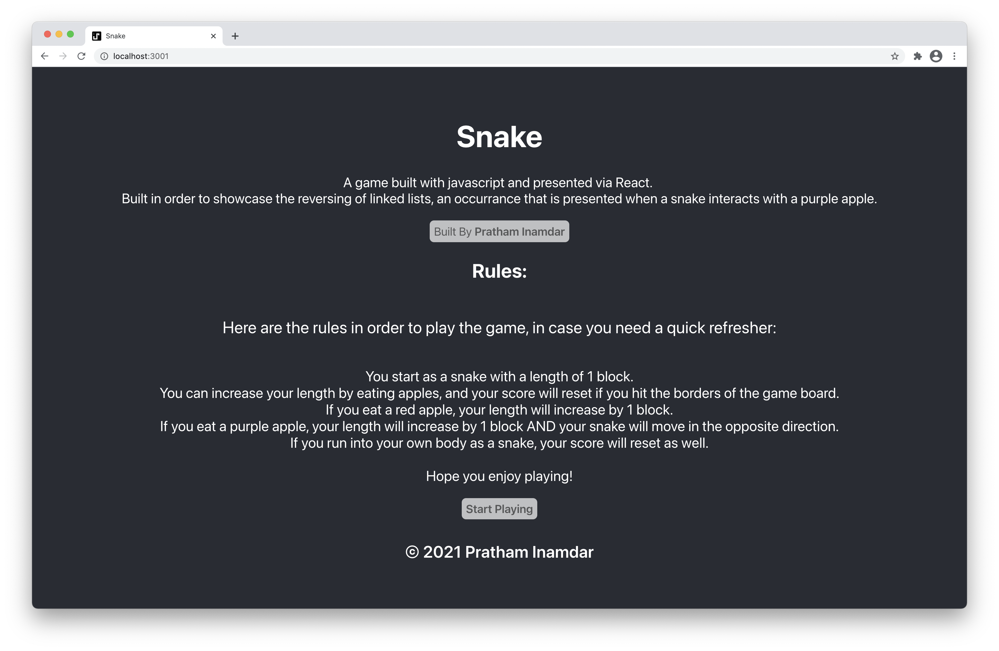
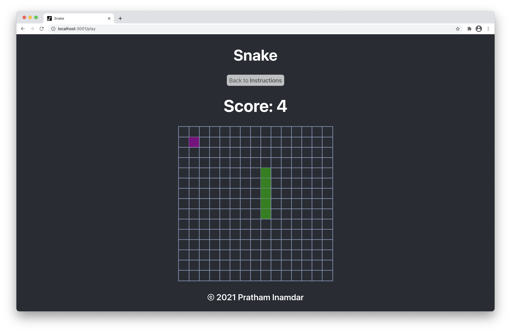

# Snake
My attempt of the game snake, featuring linked lists. Includes instructions within the web app and implements the maneuvering of link lists (such as reversing) in order to provide a more feature rich experience.

## Gameplay
The web application displays instructions before introducing the gameboard to the user, incase they needed a quick refresher.

After the user has understood the instructions and verified that they have (by clicking the "Start Playing" button, the web application redirects them to the gameboard.

